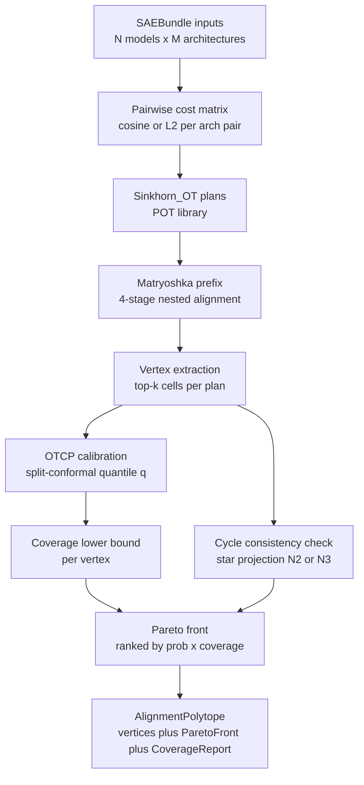

# polyalign

[](https://github.com/hinanohart/polyalign/releases)
[](LICENSE)
[](pyproject.toml)

> **N-model M-architecture SAE alignment polytope** — Sinkhorn-OT pairwise x Matryoshka prefix x OTCP split conformal coverage.

`polyalign` aligns Sparse Autoencoder (SAE) feature dictionaries across **N >= 2 models** and **M >= 1 architectures** (Transformer / SSM / Hybrid), and returns an **alignment polytope** — a Pareto-front of top-k vertices, each with a split-conformal coverage band and cycle-consistency check.

---

## Architecture / Data Flow



---

## Status

> `v0.1.0a2` is a **pre-alpha** release (post-/compact 4-agent audit honest-marketing patch over `v0.1.0a1`; see [CHANGELOG.md](CHANGELOG.md) `[0.1.0a2]` for the full list of corrections). See [docs/CLAIM.md](docs/CLAIM.md) for the explicit `[CLAIM]` vs `[non-CLAIM]` boundary. **All ablation metrics in this release are computed against synthetic ground truth** (`[DEMO]`-prefixed feature pairs); real cross-model concept pair curation is deferred to `v0.1.1`.

---

## Install

```bash
pip install polyalign
# or with torch + transformers for live model SAE extraction (deferred to v0.1.1):
pip install 'polyalign[torch,llama3,saelens]'
```

---

## Quickstart

```python
import numpy as np
from polyalign import SAEBundle, alignment_polytope

# Two pre-trained SAE decoders (n_features x d_model)
bundle_a = SAEBundle(
    model_id="gpt2-small",
    architecture="transformer",
    layer=6,
    decoder=np.random.RandomState(0).randn(64, 32).astype(np.float32),
)
bundle_b = SAEBundle(
    model_id="pythia-160m",
    architecture="transformer",
    layer=6,
    decoder=np.random.RandomState(1).randn(64, 32).astype(np.float32),
)

result = alignment_polytope([bundle_a, bundle_b], top_k=5)
print(f"vertices: {len(result.vertices)}")
for v in result.vertices:
    print(f"  joint_p={v.joint_probability:.4f}  coverage_lb={v.coverage_lower_bound:.3f}")
# Note: on synthetic random Gaussian decoders the marginal OTCP quantile q
# approaches 1.0 by construction, so coverage_lb numerically approaches
# joint_probability. The band becomes informative once a non-uniform
# calibration set is supplied (v0.1.1). See docs/CLAIM.md.
```

---

## CLI

```bash
polyalign-lint --help
polyalign-lint align --bundles bundle_a.npz,bundle_b.npz --top-k 5
```

---

## How it works

`polyalign` composes several techniques to produce an alignment polytope from raw SAE decoder matrices:

1. **Pairwise cost matrix** — builds a feature-similarity cost matrix for each model pair, applying architecture-aware adjustments (e.g., `out_proj_out` hook convention for SSM/Mamba via `recurrentlens`).
2. **Sinkhorn-OT plans** — solves optimal transport on each pair's cost matrix using the [POT](https://pythonot.github.io/) library; a post-call NaN/Inf guard is applied.
3. **Matryoshka prefix alignment** — runs a 4-stage nested prefix alignment consistent with Bussmann et al. 2025 monotonicity (non-increasing reconstruction error in prefix length, verified on synthetic seeds).
4. **Vertex extraction** — identifies top-k high-transport-probability cells from each pairwise plan. For N=2 each cell becomes one vertex; for N>=3 a star projection from bundle 0 is used (full clique enumeration deferred to v0.2).
5. **OTCP split-conformal calibration** — pools pairwise nonconformity scores and computes the marginal quantile `q` at the requested `alpha`, then derives a per-vertex `coverage_lower_bound`.
6. **Pareto front** — ranks vertices by `joint_probability * coverage_lower_bound` and returns the top-k as an `AlignmentPolytope`.

| Layer | Component | Source |
|-------|-----------|--------|
| Input | N >= 2 SAE bundles (Transformer / SSM / Hybrid) | gavagai HookedSAEBundle type adapter (score integration deferred to v0.1.1) |
| Core  | Sinkhorn-OT pairwise alignments | POT (MIT) + cross-arch cost matrix |
| Core  | Matryoshka prefix nested alignment (4 stages) | Bussmann et al. 2025 monotonicity reproduction (non-increasing recon error in prefix length on synthetic seeds) |
| Calib | OTCP split conformal threshold q | foldgauge / arXiv 2501.18991 |
| Calib | PAVA monotone isotonic | foldconsensus (vendored copy) |
| Out   | Alignment polytope vertices + Pareto front | polyalign (N=2 single edge; N>=3 star projection from bundle 0, full clique enumeration deferred to v0.2) |

---

## Related work

`polyalign` is **not** a replacement for any single existing tool — it composes 11 techniques across 7 genres (mechanistic interpretability / AI safety / cross-architecture eval / calibration / model diffing / distributed agents / SSM ecosystem). Differentiation from the most closely related open-source and academic work:

- **`gavagai`** (hinanohart, MIT, v0.2.1) — pairwise SAE indeterminacy score. `polyalign` v0.1.0a2 ships the HookedSAEBundle type adapter only (`polyalign.backends.gavagai_bridge.from_gavagai`); the gavagai score itself is NOT invoked in v0.1.0a2 — score integration is deferred to v0.1.1. The N x M polytope vertex / coverage-band / Pareto-front output structure is polyalign's contribution.
- **`AlignSAE`** (arXiv 2512.02004) — concept-aligned SAE training (training-time). `polyalign` is **post-hoc alignment** over pre-trained SAEs (no retraining required).
- **Anthropic `crosscoder`** (closed-source) — 2-model differential SAE. `polyalign` is **open-source N-model multi-architecture** and ships an OTCP split-conformal coverage band per vertex.
- **`SPARC`** (arXiv 2507.06265) — concept-aligned SAEs for cross-model / cross-modal training. `polyalign` is post-hoc and does not retrain SAEs.
- **`ckkissane/crosscoder-model-diff-replication`** — Anthropic crosscoder Euclidean replication. `polyalign` ships OTCP coverage + Sinkhorn-OT + native SSM carrier support.
- **`neelnanda-io/Crosscoders`** — early open-source crosscoder reference impl, 2-model + Transformer. `polyalign` ships N >= 2, SSM/Transformer/Hybrid carrier mix, OTCP split-conformal coverage band per vertex.
- **OpenMOSS / Llamascopium** — per-model Matryoshka SAE. `polyalign` ships **cross-architecture** Matryoshka with Sinkhorn-OT pairwise alignment.

---

## Honest-marketing scope

polyalign v0.1.0a2 ships:

- Sinkhorn-OT pairwise alignment with post-call NaN/Inf guard (live, tested)
- Matryoshka prefix-nested alignment 4-stage, monotonicity-consistent (live, tested)
- OTCP split conformal threshold q (marginal mode default; conditional function exported and unit-tested but not wired into the main pipeline — see CLAIM.md)
- Alignment polytope vertex extraction + Pareto front (live, tested; N=2 single-edge; N>=3 star projection from bundle 0, full clique enumeration deferred to v0.2)
- gavagai `HookedSAEBundle` type adapter (live, tested)
- CLI smoke test (live)

polyalign v0.1.0a2 does **not** ship:

- gavagai pairwise indeterminacy score integration — deferred to v0.1.1
- live cross-model SAE extraction at scale (Llama-3 + Gemma-3 + Mamba-2) — deferred to v0.1.1
- real hand-labeled ground truth pairs — synthetic `[DEMO]` only in this release
- non-trivial cycle-consistency threshold (default 0.0 is structurally tautological) — deferred to v0.2
- full pairwise-consistent clique enumeration for N>=3 — deferred to v0.2
- empirical coverage measurement column in the ablation (current `otcp_q` is the calibration threshold, not measured coverage) — deferred to v0.1.1
- Poincare ball / hyperbolic cost matrix — deferred to v0.2
- OKLab perceptually-uniform visualization — deferred to v0.2
- Muon optimizer integration — deferred to v0.2+

See [docs/CLAIM.md](docs/CLAIM.md), [CHANGELOG.md](CHANGELOG.md) for the full scope.

---

## License

MIT License. See [LICENSE](LICENSE).

---

## Citation

```bibtex
@software{polyalign_2026,
  author = {hinanohart},
  title  = {polyalign: N-model M-architecture SAE alignment polytope},
  year   = {2026},
  url    = {https://github.com/hinanohart/polyalign},
  version = {0.1.0a2},
  license = {MIT},
}
```

---

## Reproducibility

<!-- ABLATION:BEGIN -->

### Ablation (synthetic, `mode=synthetic`, dataset_n=36)

> All values reproduced from `results/v0.1.0a1_ablation.json` (seed=0,
> Python 3.12.3 on Linux, polyalign 0.1.0a2).
> `[DEMO]` prefix is mechanically enforced on every ground-truth row (Case C (S0 OQ3 degrade)).
> These numbers reflect **synthetic alignment quality** on Gaussian-decoder bundles, NOT real cross-model concept matching - see [docs/CLAIM.md](docs/CLAIM.md).
>
> Column notes:
> - `top5` is bounded above by `min(top_k, n_target_pairs)/n_target_pairs`. For `top_k=5` and `n_target_pairs=n_feat=24` the cap is `5/24 ≈ 0.208`; the observed `0.208` in the planted regime reflects **100% precision over the 5 emitted vertices**, not 20.8% accuracy on the full target set. `top5_precision = hits / min(5, n_target_pairs)` is recorded in the JSON.
> - `otcp_q` is the split-conformal threshold quantile (NOT empirical coverage). On doubly-stochastic Sinkhorn plans the nonconformity score `1 - p` with `p ~ 1/(n_a * n_b)` drives q to ≈1.0 by construction in every cell; a measured empirical-coverage column is deferred to v0.1.1.
> - `ece` on the `planted` regime uses `correct = (edge matches planted permutation)`. On the `random` regime it uses `correct = ones` (Case C); see CLAIM.md `[non-CLAIM]` on ECE.
> - `cycle_consistency_rate` is `1.000` everywhere because the default `cycle_threshold=0.0` is structurally tautological on non-negative plans (see CLAIM.md and `tests/test_polytope.py::test_polytope_3_bundles_cycle_threshold_discriminates`).

| setting | top1 | top5 | top5_precision | ece | otcp_q | n_vertices | cycle_consistency_rate |
|---------|------|------|----------------|-----|--------|------------|------------------------|
| `cosine_r0.05_transformer-only_random` | 0.000 | 0.000 | 0.000 | 0.9992 | 1.0000 | 5 | 1.000 |
| `cosine_r0.05_transformer-only_planted` | 0.042 | 0.208 | 1.000 | 0.9983 | 1.0000 | 5 | 1.000 |
| `cosine_r0.05_ssm-only_random` | 0.000 | 0.000 | 0.000 | 0.9992 | 1.0000 | 5 | 1.000 |
| `cosine_r0.05_ssm-only_planted` | 0.042 | 0.208 | 1.000 | 0.9983 | 1.0000 | 5 | 1.000 |
| `cosine_r0.05_hybrid-only_random` | 0.000 | 0.000 | 0.000 | 0.9992 | 1.0000 | 5 | 1.000 |
| `cosine_r0.05_hybrid-only_planted` | 0.042 | 0.208 | 1.000 | 0.9983 | 1.0000 | 5 | 1.000 |
| `cosine_r0.05_mixed_random` | 0.000 | 0.000 | 0.000 | 0.9992 | 1.0000 | 5 | 1.000 |
| `cosine_r0.05_mixed_planted` | 0.042 | 0.208 | 1.000 | 0.9983 | 1.0000 | 5 | 1.000 |
| `l2_r0.05_mixed_random` | 0.000 | 0.000 | 0.000 | 0.9992 | 1.0000 | 5 | 1.000 |
| `l2_r0.05_mixed_planted` | 0.042 | 0.208 | 1.000 | 0.9983 | 1.0000 | 5 | 1.000 |
| `cosine_r0.01_mixed_random` | 0.000 | 0.000 | 0.000 | 0.9983 | 1.0000 | 5 | 1.000 |
| `cosine_r0.01_mixed_planted` | 0.042 | 0.208 | 1.000 | 0.9983 | 1.0000 | 5 | 1.000 |
| `cosine_r0.1_mixed_random` | 0.000 | 0.000 | 0.000 | 0.9997 | 1.0000 | 5 | 1.000 |
| `cosine_r0.1_mixed_planted` | 0.042 | 0.208 | 1.000 | 0.9988 | 1.0000 | 5 | 1.000 |

> Reproduce: `uv run python scripts/run_ablation.py --seed 0`

<!-- ABLATION:END -->
